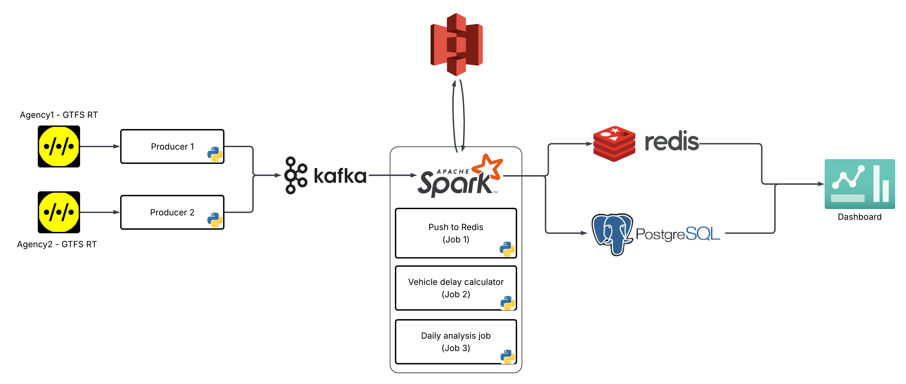
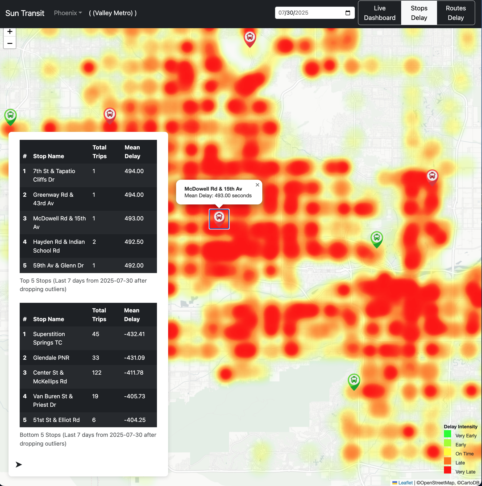

# 🚌 SunTransit

SunTransit continuously fetches live vehicle positions from multiple transit agencies, calculates delays for each stop, and stores this data for analysis. The system powers a dashboard that lets users track real-time vehicle locations and evaluate agency performance, similar to how FlightRadar24 visualizes flights. Designed for fault tolerance, scalability, and cloud agnosticism, SunTransit can be deployed seamlessly across any cloud platform.

Due to cost constraints, SunTransit is currently online only for fetching data from two transit agencies: Valley Metro and Massachusetts Bay Transportation Authority, as it is deployed locally to save on cloud costs.


## System Walkthrough



### Major Components
1. **Kafka**: Kafka is being used as a message broker; there are n topics for n transit agencies. Each topic is dedicated to that agency's vehicle positions.  
2. **Spark**: Spark handles all major data processing tasks due to its scalability, distributed computing capabilities, and support for large-scale batch analytics. It processes GTFS real-time feeds from Kafka Topics and schedules to compute delays efficiently. Primarily, it is used for three jobs (1 streaming, and 2 batch), discussed later.
3. **Amazon S3**: This is being used to store the delay of each vehicle for the stop it stopped at. Data is saved in parquet format partitioned by agency, and date.
4. **Redis**: This is used just to store the live position for each vehicle of a transit agency. The positions have a TTL of 2 minutes. This is only used by the dashboard to visualize all the vehicles on the map.
5. **PostgreSQL**: This database is used to store the average delay for all the stops for each route, an agency. It has 3 tables: stops_mean_delay, route_mean_delay, agency_mean_delay.
6. **MongoDB**: This is just used to store the offset for batch jobs so that the next job starts from the next available message in Kafka topic

### Jobs and files
1. `producer/producer.py`  
   This simply fetches the GTFS RT Feeds from a transit agency and pushes it to the respective Kafka topic.
2. `spark-jobs/push_redis.py` (Job 1)
   This is a Spark streaming job which takes vehicle positions from the Kafka topic, discards repeated messages, and saves the latest vehicle position in Redis time series with a retention of 2 minutes.
3. `spark-jobs/batch/delay_calculator.py` (Job 2)
   This is a Spark batch job that is configured to run every hour to process the last hour's messages from the Kafka topic. It calculates the delay of a vehicle to reach the scheduled stop, and saves the data to S3 in Parquet format.
4. `spark-jobs/analyze_daily_records.py`  (Job 3)
   This is also a batch job that is configured to run in the morning at 2AM, to process the previous day's data (T-1). It reads the last day's data from S3, and finds the mean delay across the trips for each stop and route, then for the whole agency.

---
## Screenshots

1. Live Tracking  
  

2. Stops Delay Heatmap
  


---

## Project Setup

### Provisioning Cloud Resources

Before running SunTransit, provision the following cloud resources (you can use your preferred providers; examples are given below):

1. **S3 Bucket**  
  Used for storing Parquet files with delay data.  
  _Example: [Amazon S3](https://aws.amazon.com/s3/)_

2. **MongoDB Database**  
  Used for storing batch job offsets.  
  _Example: [MongoDB Atlas](https://www.mongodb.com/products/platform/atlas-database)_

3. **PostgreSQL Database**  
  Used for storing aggregated delay metrics.  
  _Example: [Neon.tech](https://neon.tech/)_

Make sure to note the connection details for each resource, as you'll need them when creating your `credentials.env` file.

### Creating `credentials.env`

1. After provisioning your cloud resources, create a `credentials.env` file with the following values:

```env
AWS_ACCESS_KEY_ID=<your-aws-access-key-id>
AWS_SECRET_ACCESS_KEY=<your-aws-secret-access-key>

REDIS_HOST=redis
REDIS_PASSWORD=myPassword123

MONGODB_URL="mongodb+srv://<username>:<password>@<cluster-url>/<dbname>"
POSTGRESQL_URL="jdbc:postgresql://<host>:<port>/<dbname>"
```

2. Place this `credentials.env` file in both of these locations:
  - `spark-jobs/env/credentials.env`
  - `flask_app/credentials.env`

3. Update `S3_BUCKET` in `spark-jobs/env/.env` with your bucket name.

---

### Starting the Services

1. **Start all services with Docker Compose:**
  ```bash
  docker compose up -d --scale spark-worker=3
  ```

2. **Initialize Kafka topics and start the producer (Job 1):**
  ```bash
  bash project-init.sh
  ```

3. **Schedule batch and analysis jobs:**
  - Set up a cron job to run `batch_job.sh` every hour.
  - Set up a cron job to run `analysis_job.sh` daily at 2 AM.

Example cron entries:
```cron
0 * * * * /path/to/batch_job.sh
0 2 * * * /path/to/analysis_job.sh
```


## ☁️ Deploy on Kubernetes (Optional)

Currently working on


---

Built with ❤️ by [@rishitoshsingh](https://github.com/rishitoshsingh)
---