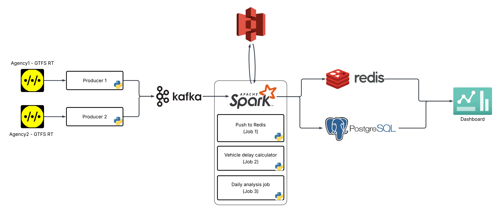
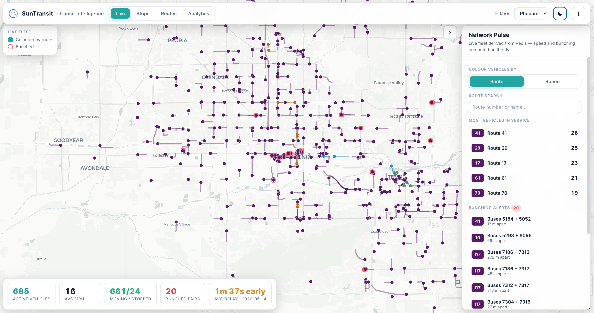
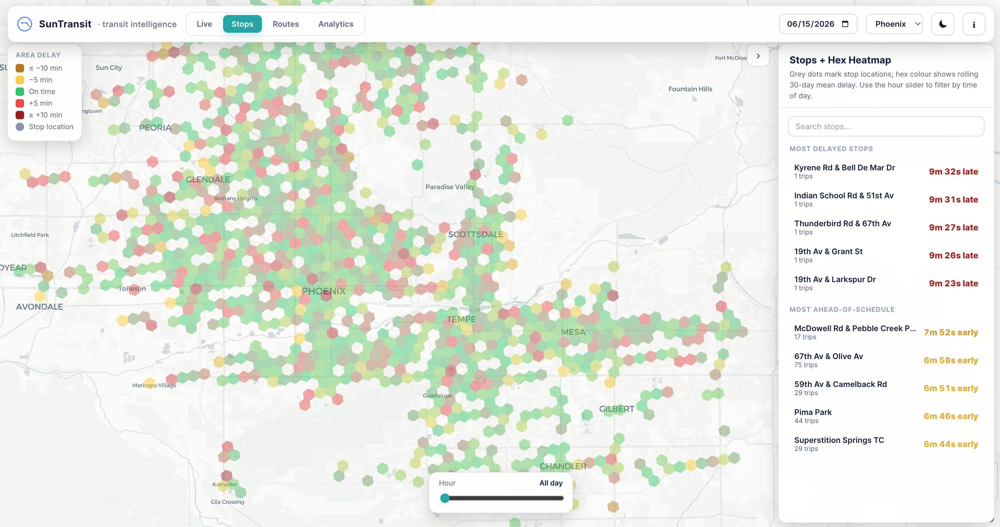
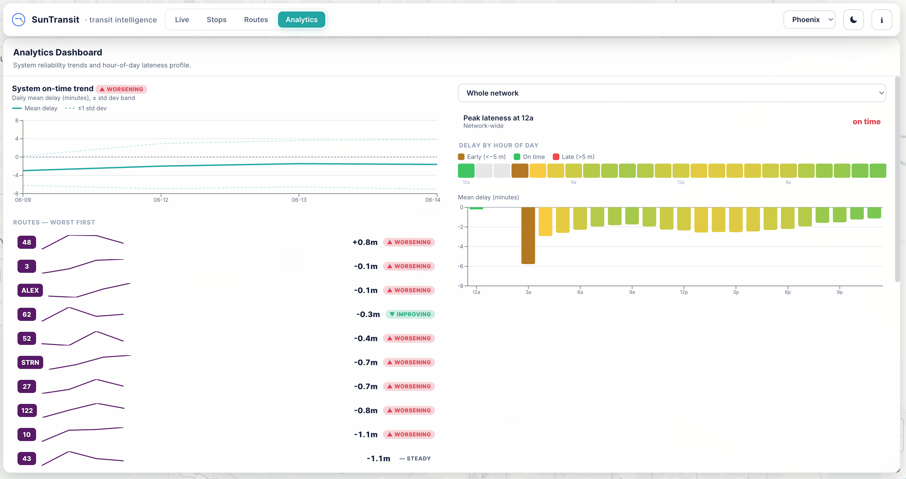
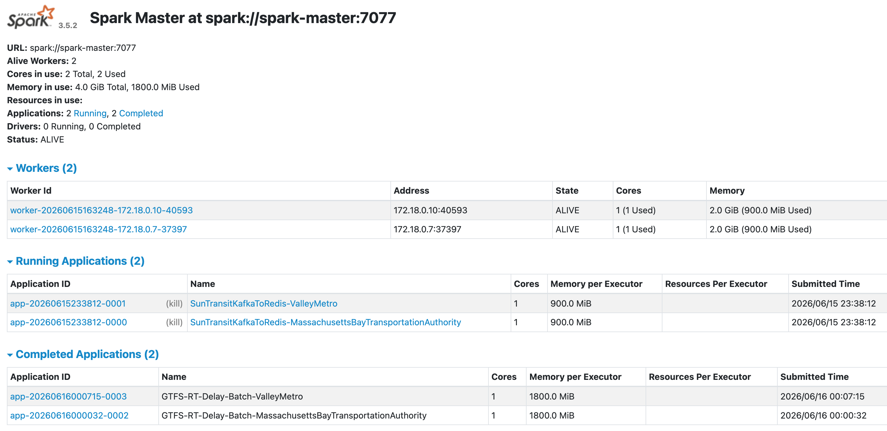

<p align="center">
  
</p>

# SunTransit

SunTransit continuously fetches live vehicle positions from multiple transit agencies, calculates delays for each stop, and stores this data for analysis. The system powers a dashboard that lets users track real-time vehicle locations and evaluate agency performance, similar to how FlightRadar24 visualizes flights. Designed for fault tolerance, scalability, and cloud agnosticism, SunTransit can be deployed seamlessly across any cloud platform.

Due to cost constraints, SunTransit is currently online only for fetching data from two transit agencies: Valley Metro and Massachusetts Bay Transportation Authority, as it is deployed locally to save on cloud costs.


## System Walkthrough



### Major Components
1. **Kafka**: Used as a message broker with one topic per transit agency. Each topic receives that agency's live vehicle positions.
2. **Spark**: Handles all data processing — one streaming job and two batch jobs — due to its scalability and distributed computing support.
3. **Amazon S3**: Stores delay records in Parquet format, partitioned by agency and date.
4. **Redis**: Holds live vehicle positions per agency with a 2-minute TTL. Used exclusively by the dashboard to render the live map.
5. **PostgreSQL**: Stores aggregated delay metrics in three tables: `stops_mean_delay`, `route_mean_delay`, and `agency_mean_delay`. Runs in Docker — no external database needed.

### Jobs and Files
1. `producer/producer.py`
   Fetches GTFS-Realtime feeds from a transit agency and pushes vehicle positions to the respective Kafka topic.

2. `spark-jobs/push_redis.py` (Streaming job)
   Spark Structured Streaming job that reads vehicle positions from Kafka, deduplicates messages, and writes the latest position per vehicle to Redis with a 2-minute retention. Runs as a systemd service (`suntransit-mbta-redis.service` / `suntransit-valley-metro-redis.service`).

3. `spark-jobs/batch/delay_calculator.py` (Hourly batch job)
   Processes the last hour of Kafka messages, calculates stop-level arrival delay against the GTFS schedule, and writes results to S3 as Parquet. Triggered by `batch_jobs.sh`.

4. `spark-jobs/analyze_daily_records.py` (Daily batch job)
   Runs at 2 AM to process the previous day's S3 data. Computes mean delay per stop, route, and agency and writes aggregates to PostgreSQL. Triggered by `analysis_job.sh`.

5. `spark-jobs/hourly_profile.py` (Hourly profile job)
   Builds hour-of-day delay profiles from S3 data for use in delay prediction and trend analysis. Triggered by `hourly_profile_job.sh`.

---
## Demo

[](https://youtu.be/WqL5QKEByUs)

## Screenshots

1. Live Tracking
  

2. Stops + Hex Heatmap
  

3. Analytics Dashboard
  

4. Spark Master UI
  


---

## Project Setup

### Provisioning Cloud Resources

Only one external cloud resource is required:

1. **S3 Bucket**
   Used for storing Parquet files with delay data.
   _Example: [Amazon S3](https://aws.amazon.com/s3/)_

PostgreSQL and Redis run as Docker containers — no external databases needed.

---

### Creating `credentials.env`

Create a `credentials.env` file in the project root with your AWS credentials:

```env
AWS_ACCESS_KEY_ID=<your-aws-access-key-id>
AWS_SECRET_ACCESS_KEY=<your-aws-secret-access-key>
```

Then update `S3_BUCKET` in `spark-jobs/env/.env` with your bucket name:

```env
S3_BUCKET=s3a://<your-bucket-name>
```

---

### Starting the Services

1. **Start all services:**
   ```bash
   docker compose up -d --scale spark-worker=2
   ```
   This starts Kafka, Zookeeper, Spark (master + 2 workers), Redis, PostgreSQL, and the web dashboard.

2. **Initialize Kafka topics:**
   ```bash
   bash project-init.sh
   ```

3. **Start the Kafka→Redis streaming jobs** (systemd):
   ```bash
   sudo systemctl enable --now suntransit-mbta-redis.service
   sudo systemctl enable --now suntransit-valley-metro-redis.service
   ```

4. **Schedule batch jobs via cron:**
   ```cron
   0 * * * * /path/to/batch_jobs.sh
   0 * * * * /path/to/hourly_profile_job.sh
   0 2 * * * /path/to/analysis_job.sh
   ```

5. **Access the dashboard** at `http://localhost:8082`.

---

Built with ❤️ by [@rishitoshsingh](https://github.com/rishitoshsingh)
